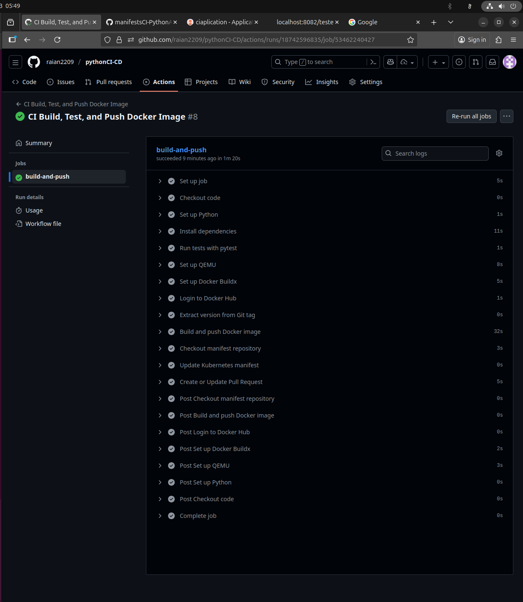
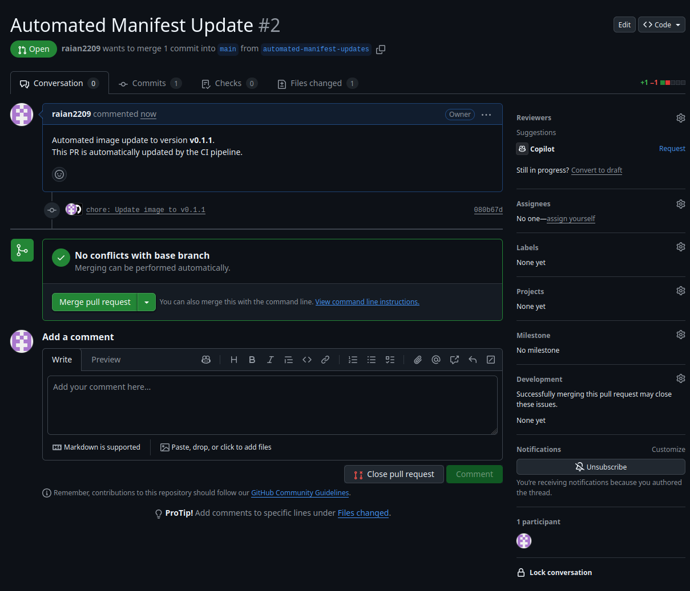
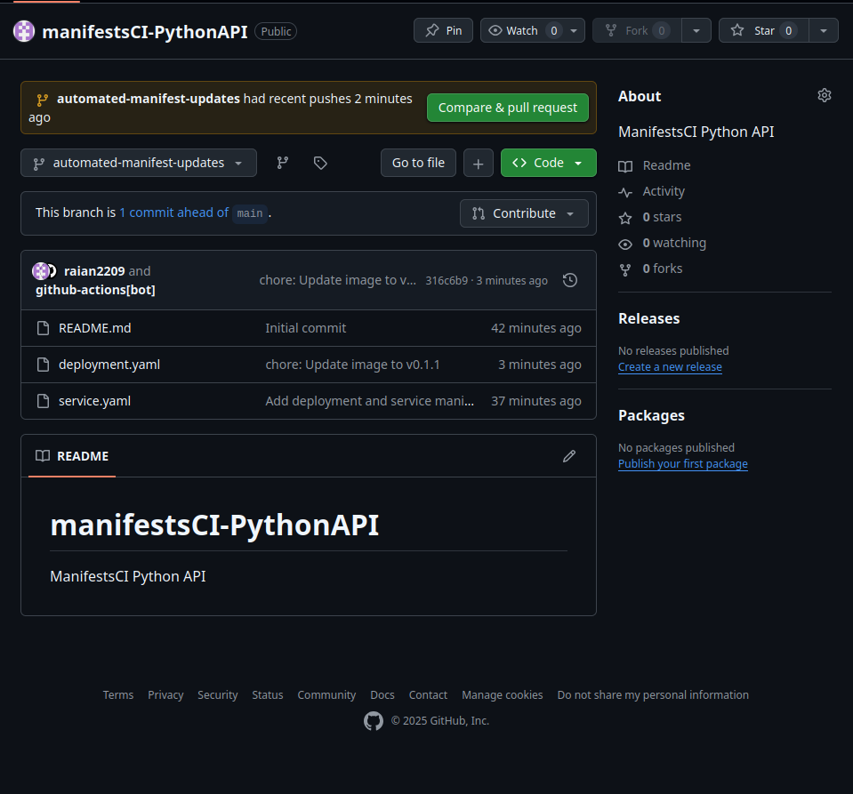
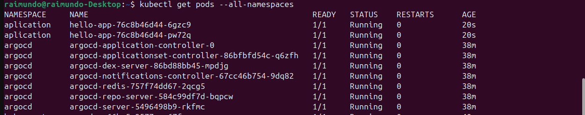
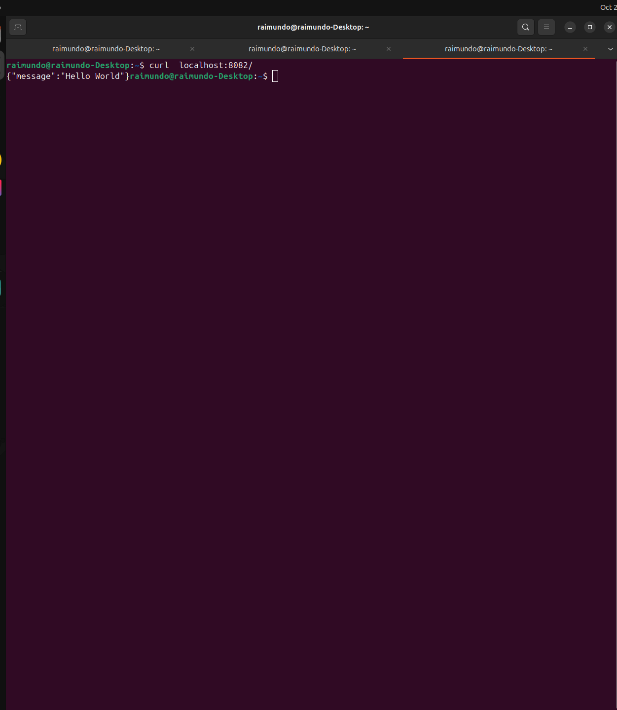
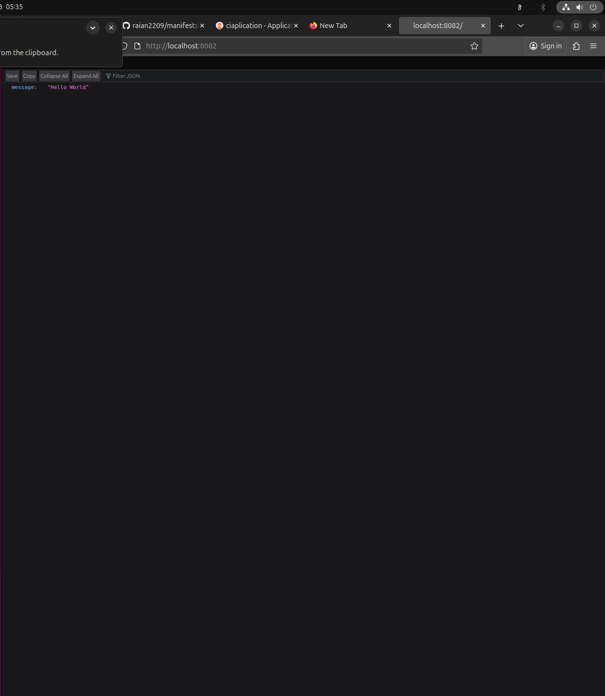
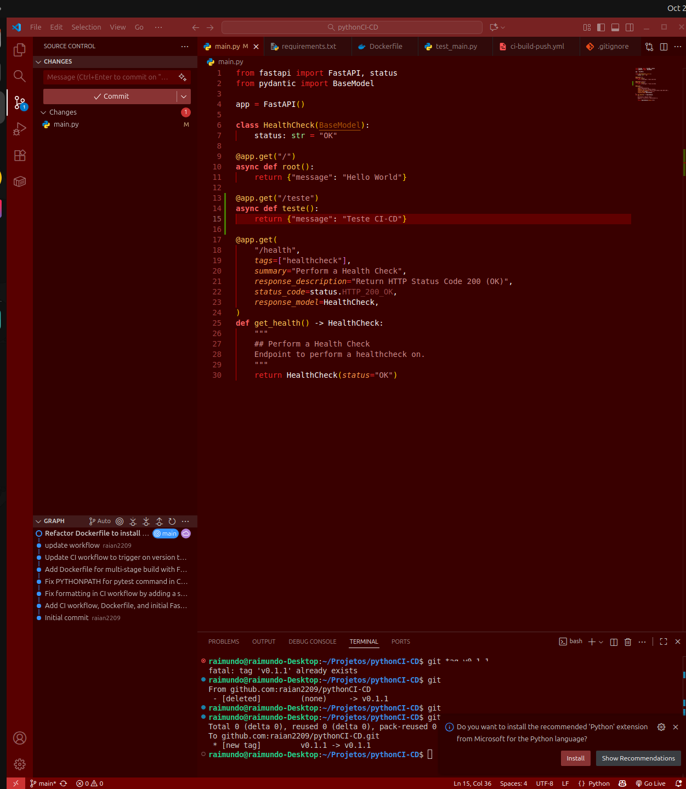
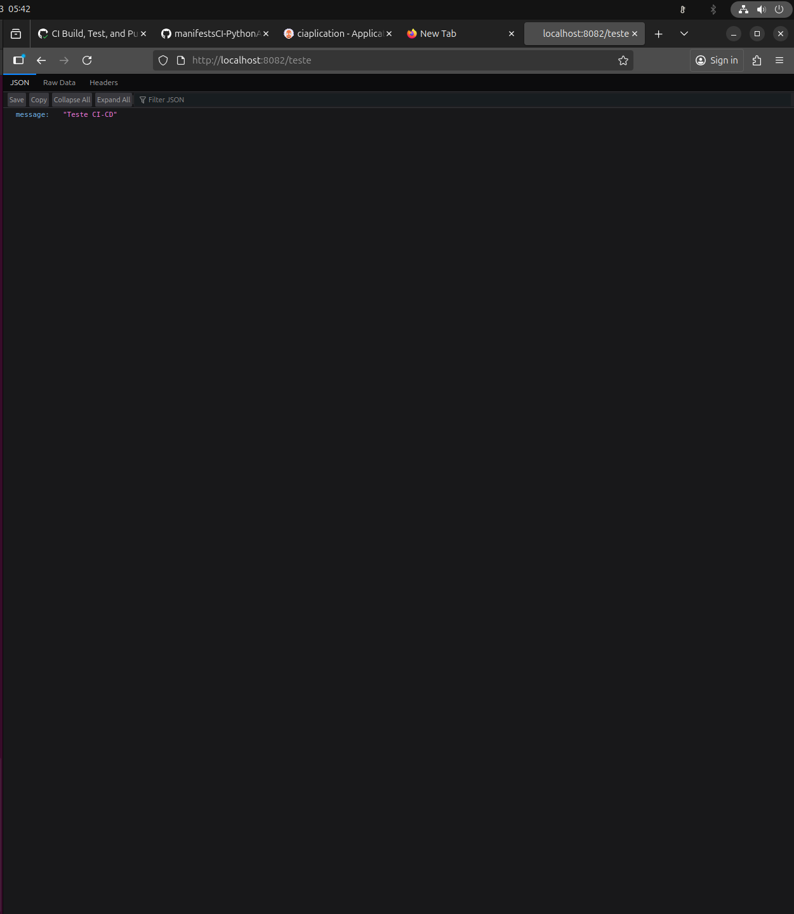

# CI/CD com FastAPI, GitHub Actions e GitOps

Este repositório contém uma aplicação FastAPI de exemplo e um pipeline de CI/CD robusto construído com GitHub Actions. O objetivo do projeto é automatizar o ciclo completo de desenvolvimento: desde a validação do código com testes até a entrega contínua em um cluster Kubernetes, seguindo as melhores práticas de GitOps.
## 🏛️ Arquitetura

Este projeto adota uma arquitetura GitOps baseada em dois repositórios distintos para garantir uma clara separação de interesses:

1.  **Repositório da Aplicação (`pythonCI-CD` - este repositório):**

      * **Responsabilidade:** Contém o código-fonte da aplicação FastAPI, os testes automatizados (`pytest`) e a definição do contêiner (`Dockerfile`).
      * **Pipeline de CI:** O workflow do GitHub Actions neste repositório é responsável por testar o código, construir a imagem Docker e publicá-la no Docker Hub com uma tag de versão semântica.

2.  **Registro de Contêiner (Docker Hub):**

      * **Responsabilidade:** Atua como o repositório central para as imagens Docker versionadas da aplicação. É a fonte de onde o cluster Kubernetes irá baixar os artefatos para implantação.

Link: <https://hub.docker.com/r/raian2209/hello-app>

3.  **Repositório de Manifestos (`manifestsCI-PythonAPI`):**

      * **Responsabilidade:** Atua como a única fonte da verdade para o estado desejado da nossa aplicação no cluster Kubernetes. Contém apenas os manifestos de implantação (`deployment.yaml`, `service.yaml`).
      * **Pipeline de CD:** O pipeline de CI da aplicação, após publicar uma nova imagem, abre um Pull Request neste repositório para atualizar a tag da imagem no `deployment.yaml`. A fusão (merge) desse PR aciona a implantação via ArgoCD.

Link : <https://github.com/raian2209/manifestsCI-PythonAPI>


## 🛠️ Tecnologias Utilizadas

  * **Backend:** FastAPI
  * **Testes:** Pytest
  * **Containerização:** Docker
  * **CI/CD:** GitHub Actions
  * **Registro de Contêiner:** Docker Hub
  * **Orquestração:** Kubernetes
  * **Entrega Contínua (GitOps):** ArgoCD

## 📁 Estrutura do Projeto

```
.
├──.github/
│   └── workflows/
│       └── ci-build-push.yml      # Definição do pipeline de CI/CD
├── tests/
│   └── test_main.py      # Testes automatizados com Pytest
├──.gitignore
├── Dockerfile            # Instruções para construir a imagem Docker
├── main.py               # Código da aplicação FastAPI
└── requirements.txt      # Dependências Python do projeto
```

## 🚀 Setup e Desenvolvimento Local

Siga os passos abaixo para configurar e executar a aplicação em seu ambiente local.

1.  **Clone o repositório:**

    ```bash
    git clone https://github.com/raian2209/pythonCI-CD.git
    cd pythonCI-CD
    ```

2.  **Crie e ative um ambiente virtual:**

    ```bash
    # Crie o ambiente
    python3 -m venv .venv

    # Ative o ambiente (Linux/macOS)
    source venv/bin/activate
    ```

3.  **Instale as dependências:**

    ```bash
    pip install -r requirements.txt
    ```

4.  **Execute os testes (Opcional, mas recomendado):**

    ```bash
    pytest
    ```

5.  **Inicie o servidor de desenvolvimento:**

    ```bash
    uvicorn main:app --reload
    ```

    A aplicação estará disponível em `http://127.0.0.1:8000`.

## ⚙️ Análise do Workflow de CI/CD (`.github/workflows/main.yml`)

Este workflow automatiza o processo de teste, construção, versionamento e a proposta de implantação da aplicação.

### Gatilho (Trigger)

O pipeline é acionado automaticamente sempre que uma nova **tag Git** no formato `v*` (ex: `v0.1.0`, `v1.2.3`) é enviada (push) para o repositório. Isso garante que apenas versões formalmente designadas gerem um novo artefato de implantação.

### Permissões

O bloco `permissions` é configurado para conceder ao `GITHUB_TOKEN` as permissões necessárias para que as actions possam escrever no repositório (para o checkout) e criar Pull Requests.

### Passos do Job (`build-and-push`)

1.  **Checkout & Setup:**

      * `actions/checkout@v4`: Baixa o código-fonte do repositório.
      * `actions/setup-python@v5`: Configura o ambiente Python 3.10.
      * `Install dependencies`: Instala as bibliotecas listadas no `requirements.txt`.

2.  **Teste Automatizado (Quality Gate):**

      * `Run tests with pytest`: Executa a suíte de testes. **Este é um portão de qualidade crítico.** Se qualquer teste falhar, o workflow é interrompido imediatamente, impedindo que código com defeito seja empacotado ou implantado.

3.  **Construção e Publicação da Imagem Docker:**

      * `Set up QEMU` & `Set up Docker Buildx`: Configuram o ambiente para a construção de imagens Docker.
      * `Login to Docker Hub`: Autentica-se no Docker Hub usando os secrets `DOCKER_USERNAME` e `DOCKER_PASSWORD`. 
      * `Extract version from Git tag`: Extrai o nome da tag Git (ex: `v0.1.0`) e o armazena na variável de ambiente `IMAGE_TAG`.
      * `Build and push Docker image`: Constrói a imagem Docker e a publica no Docker Hub, usando a versão extraída da tag Git para nomear a imagem (ex: `seu-usuario/hello-app:v0.1.0`).

4.  **Atualização do Manifesto (Entrega Contínua):**

      * `Checkout manifest repository`: Clona o repositório de manifestos (`raian2209/manifestsCI-PythonAPI`) para um diretório separado, usando uma `SSH_PRIVATE_KEY` para autenticação. 
      * `Update Kubernetes manifest`: Usa o comando `sed` para encontrar e substituir a tag da imagem no arquivo `deployment.yaml` pela nova `IMAGE_TAG`.
      * `Create or Update Pull Request`: Utiliza a action `peter-evans/create-pull-request` para criar ou atualizar um Pull Request no repositório de manifestos. 
          * Usa uma branch fixa (`automated-manifest-updates`) para evitar a criação de múltiplas branches.
          * Requer um `CROSS_REPO_PAT` (Personal Access Token) para ter permissão de criar o PR em outro repositório.

## 🏷️ Como Fazer um Release (Acionar o Pipeline)

Para criar uma nova versão da aplicação e acionar o pipeline, siga os passos:

1.  Certifique-se de que sua branch `main` está atualizada com o código que você deseja lançar.
2.  Crie uma nova tag Git localmente (seguindo o versionamento semântico):
    ```bash
    # Exemplo para a primeira versão
    git tag v0.1.0
    ```
3.  Envie a tag para o repositório remoto no GitHub:
    ```bash
    git push origin v0.1.0
    ```
    Isso acionará o workflow, que pode ser monitorado na aba "Actions" do seu repositório.

## 🔐 Configuração de Segredos

Para que o workflow funcione, os seguintes segredos devem ser configurados em **Settings \> Secrets and variables \> Actions** do repositório da aplicação:

| Secret | Descrição | Como Gerar |
| :--- | :--- | :--- |
| `DOCKER_USERNAME` | Seu nome de usuário do Docker Hub. | - |
| `DOCKER_PASSWORD` | Um Token de Acesso do Docker Hub (não sua senha). | Vá para Docker Hub \> Account Settings \> Security \> New Access Token. |
| `SSH_PRIVATE_KEY` | A chave SSH privada para dar ao workflow permissão de escrita no repositório de manifestos. | Execute `ssh-keygen -t ed25519 -f deploy_key` localmente. A chave pública (`deploy_key.pub`) deve ser adicionada como uma "Deploy Key" com permissão de escrita no repositório `manifestsCI-PythonAPI`. [7] |
| `CROSS_REPO_PAT` | Um Personal Access Token (Classic) do GitHub com escopo `repo`. | Vá para GitHub \> Settings \> Developer settings \> Personal access tokens \> Tokens (classic) \> Generate new token. |

## 🌐 Processo de Implantação (Deployment)

1.  Após o workflow ser concluído com sucesso, um Pull Request será aberto (ou atualizado) no repositório `manifestsCI-PythonAPI`.
2.  Um membro da equipe deve revisar as alterações (a atualização da tag da imagem) e aprovar o Pull Request.
3.  Uma vez que o PR é mesclado na branch `main`, o ArgoCD, que está monitorando este repositório, detectará a mudança.
4.  O ArgoCD iniciará automaticamente o processo de sincronização, aplicando o novo manifesto e fazendo o Kubernetes realizar um *rolling update* da aplicação para a nova versão. 


## Evidencias / Entregas

1. Build e push da imagem no Docke Hub
Workflow Triger:



Branch Modificada diretamente (DEV):



Abre push na branch main:




2. argoCD sincronizado


3. Get all Pods 



4. response  da aplicação 





5. atualisação automatica:

Foi feito um push , adicionando este endPoint a aplicação:


Endpoint funcionando depois de sync na aplicação: 

